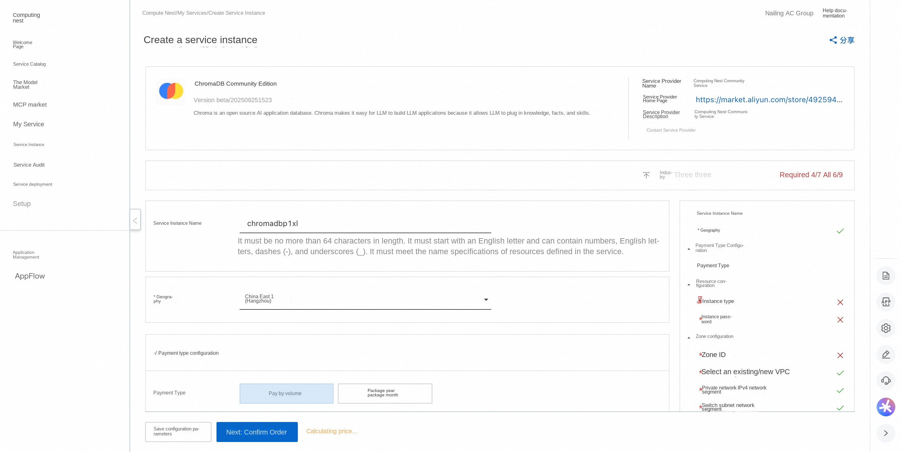
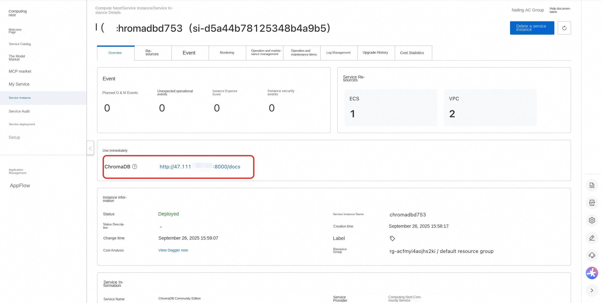
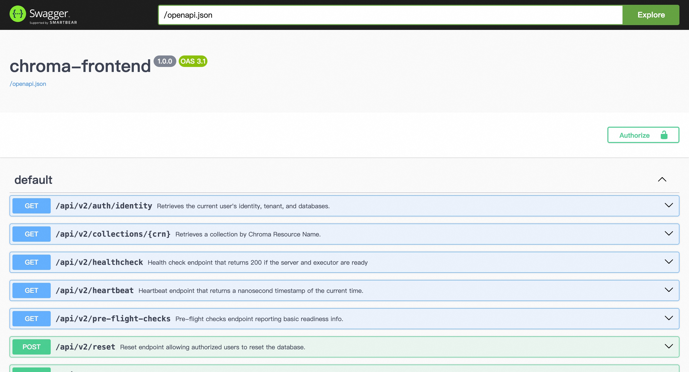

##🌟Service Introduction

Chroma is an open source AI application database. Chroma makes it easy for LLM to build LLM applications because it allows LLM to insert knowledge, facts, and skills.

##💰Billing Description

The cost of deploying Chroma Community Edition in Compute Nest mainly involves:

-Selected vCPU and memory specifications
-System disk type and capacity
-public network bandwidth

##🚀Deployment Process

1. Visit the Computing Nest ChromaDB Community Edition [Deployment Link](https://computenest.console.aliyun.com/service/instance/create/cn-hangzhou?type=user&ServiceId=service-b9096ffacaa744e1a488) and fill in the deployment parameters as prompted:

2. After completing the parameters, you can see the corresponding RFQ details. After confirming the parameters, click **Next: Confirm Order**.

3. Confirm that the order is complete and agree to the service agreement and click **Create Now** to enter the deployment phase.

4. Wait for the deployment to complete and enter the service instance details page.

5. Click on the service address and use the ChromaDB Community Edition.

#📚Guidelines for use

For more use, please refer to the ChromaDB [official website document](https://docs.trychroma.com/docs/overview/introduction).