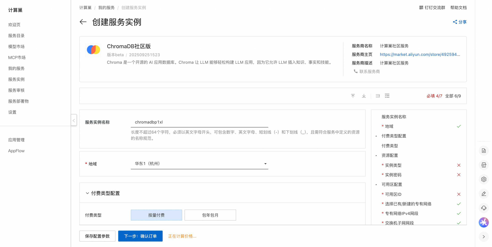
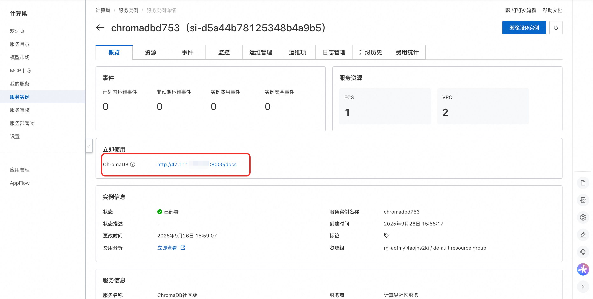
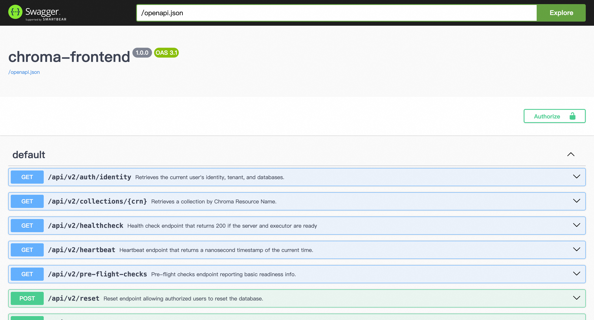

## 🌟 服务简介

Chroma 是一个开源的 AI 应用数据库。Chroma 让 LLM 能够轻松构建 LLM 应用，因为它允许 LLM 插入知识、事实和技能。

## 💰 计费说明

Chroma社区版在计算巢部署的费用主要涉及：

- 所选vCPU与内存规格
- 系统盘类型及容量
- 公网带宽

## 🚀 部署流程

1. 访问计算巢ChromaDB社区版[部署链接](https://computenest.console.aliyun.com/service/instance/create/cn-hangzhou?type=user&ServiceId=service-b9096ffacaa744e1a488)，按提示填写部署参数：
   

2. 参数填写完成后可以看到对应询价明细，确认参数后点击**下一步：确认订单**。

3. 确认订单完成后同意服务协议并点击**立即创建**进入部署阶段。

4. 等待部署完成后进入服务实例详情页。
   

5. 点击服务地址并使用ChromaDB社区版。
   

# 📚 使用指南

更多用法请参考ChromaDB[官网文档](https://docs.trychroma.com/docs/overview/introduction)。